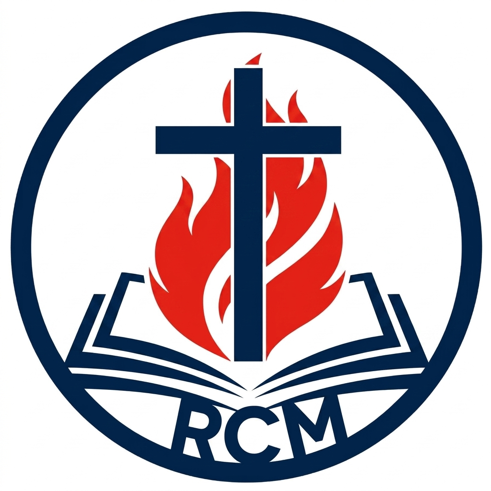

# RCM File Sender (v1.0.2)

A high-performance, cross-platform local file transfer tool designed for moving massive files (100GB+) from mobile devices to your computer over local Wi-Fi.



## 🚀 Features
- **Massive File Support**: Optimized for 100GB+ files using Node.js streaming (RAM usage stays low regardless of file size).
- **Cross-Platform**: Full support for **Windows, macOS, and Linux**.
- **Smart Batching**: Automatically collapses multiple file uploads into a single, clean progress bar.
- **Session Lock**: Limits connections to one uploader at a time for maximum dedicated bandwidth.
- **Zero Configuration**: No cloud or internet required. Transfers happen entirely over your local Wi-Fi.
- **Auto-Duplicate Handling**: Automatically renames files if they already exist (e.g., `video (1).mp4`).
- **Desktop Destination**: Saves everything to a dedicated `RCM_Uploads` folder on your desktop.

## 🛠 Installation

### For Windows/macOS/Linux
1. Download the latest release from the [Releases](https://github.com/funnyoldmonkey/rcmfilesender/releases) page.
2. **Windows**: Run the portable `.exe`.
3. **macOS**: Open the `.dmg` and drag to Applications.
4. **Linux**: Run the `.AppImage`.

## 📖 How to Use
1. Open the app on your computer.
2. Scan the QR code with your phone (must be on the same Wi-Fi).
3. Select your files and hit upload.
4. Your files will appear in the `RCM_Uploads` folder on your Desktop.

## 💻 Technical Stack
- **Core**: Electron, Node.js
- **Server**: Express, Socket.io, Busboy (Streaming)
- **UI**: Vanilla HTML/CSS/JS

## 🤝 Build & Development
```bash
npm install
npm start          # Run the app
npm run build:all  # Build for all platforms
```

Built by **Jall Fiel**
